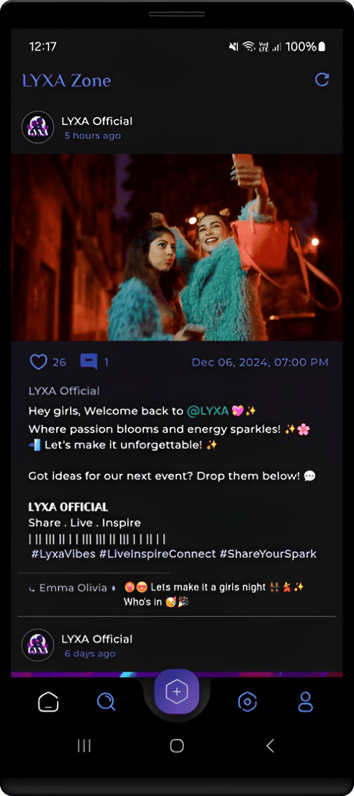
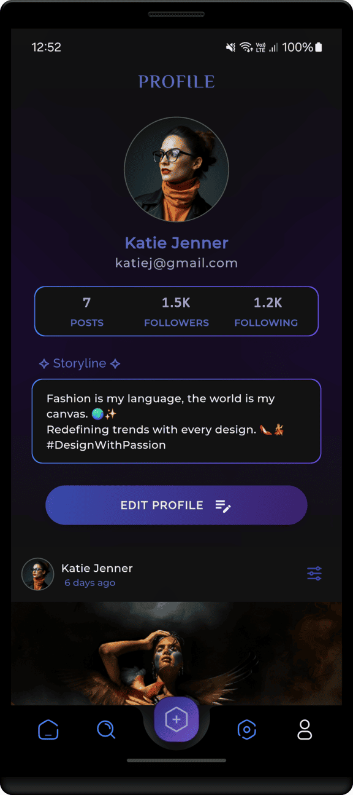

<h1 align="center" >    ✦ ğ‹ğ˜ğ—ğ€ ğ‘³ğ’Šğ’—𒆠✦     ♨ [ ꜰʟᴜᴛᴛᴇʀ  ᴘʀᴏᴊᴇᴄᴛ ] ♨</h1>

## ɪ  ⁃  ᴘʀᴏᴊᴇᴄᴛ ɪɴꜰᴏ

> [!Note]
> **This project is still in its early development stage.**
#

**LYXA Live** is a dynamic social media app built with *Flutter and Dart*, designed to help users Share, Live, and Inspire. This app provides an engaging platform for users to connect, share their stories, and inspire each other with its sleek, user-friendly interface.

Built using the *BLoC* pattern for state management, LYXA ensures smooth, responsive interactions and a scalable architecture for future enhancements.

 

⁃ ᴄᴏɴᴛᴇɴᴛꜱ ⁃ 
[ᴜꜱᴇʀ ꜰᴇᴀᴛᴜʀᴇꜱ](#ɪɪ--ᴡʜᴀᴛ-ᴜꜱᴇʀꜱ-ᴄᴀɴ-ᴇxᴘᴇᴄᴛ)
| [ᴀᴘᴘ ꜱᴄʀᴇᴇɴꜱ](#ɪɪɪ--ᴠɪꜱᴜᴀʟ-ᴛᴏᴜʀ-ᴏꜰ-ᴛʜᴇ-ᴀᴘᴘ-ꜱᴄʀᴇᴇɴꜱ)
| [ᴘʀᴏᴊᴇᴄᴛ ʙʀᴀɴᴄʜᴇꜱ](#ɪᴠ--ᴘʀᴏᴊᴇᴄᴛ-ʙʀᴀɴᴄʜᴇꜱ)
| [ᴅᴇᴠ ꜰᴇᴀᴛᴜʀᴇꜱ](#ᴠ--ʙᴇʜɪɴᴅ-ᴛʜᴇ-ᴄᴏᴅᴇ-ᴅᴇᴠ-ꜰᴇᴀᴛᴜʀᴇꜱ)
| [ᴘʀᴏᴊᴇᴄᴛ ɴᴏᴛᴇꜱ](#ᴠɪ--ᴘʀᴏᴊᴇᴄᴛ-ɴᴏᴛᴇꜱ)

 

 
 

 

## ɪɪ ⁃ ᴡʜᴀᴛ ᴜꜱᴇʀꜱ ᴄᴀɴ ᴇxᴘᴇᴄᴛ

### ⭓ Features

- **Post Sharing**: Share photos, videos, and stories with your followers and the world.
- **Real-time Interactions**: Engage with others through comments, likes, and shares.
- **Inspiring Content**: Discover motivational and creative posts from your community.
- **Profile Customization**: Personalize your profile with photos, bios, and links.
- **Activity Feed**: Stay updated on friends' activities, likes, and comments.
- **Live Events**: Join and participate in live events, chats, and discussions.
- **Followers & Following**: Build your community by following others and gaining followers.
- **Content Discovery**: Explore trending posts, hashtags, and popular topics.
  
##
### ⭓ Requirements
## **System Requirements**

### Android
- **Android 7.0 (Nougat)** and Above
- **Minimum SDK Version**: 24

### iOS
- **iOS 11.0** and Above

### Web
- **Supported Browsers**:
  - Google Chrome (latest stable)
  - Firefox (latest stable)
  - Safari (latest stable)
  - Edge (latest stable)

- **Required Features**:
  - Modern JavaScript and HTML5 support
  - WebAssembly (for performance)

##
### ⭓ Permissions
- Internet

## ɪɪɪ ⁃ ᴠɪꜱᴜᴀʟ ᴛᴏᴜʀ ᴏꜰ ᴛʜᴇ ᴀᴘᴘ: ꜱᴄʀᴇᴇɴꜱ

  

#

   

<kbd>[&nbsp; ⮝ &nbsp;  BACK TO TOP  &nbsp;&nbsp;&nbsp;](#ɪ----ᴘʀᴏᴊᴇᴄᴛ-ɪɴꜰᴏ) </kbd>

#
## ɪᴠ ⁃ ᴘʀᴏᴊᴇᴄᴛ ʙʀᴀɴᴄʜᴇꜱ

<!-- Main / Master / Production Branch -->

> <samp> **PRODUCTION BRANCH :**  </samp>  
> Stable code for deployment  
> ➲ [main][branch-main]

> <samp> **STAGING BRANCH :**  </samp>  
> `FLOW | Staging → Production`  
> For pre-release testing, which ensures that the code is stable, bug-free, and ready for deployment.
<!--   
> ➲ [staging][branch-staging]
> -->

> <samp> **DEVELOPMENT BRANCH :**  </samp>  
> `FLOW | Development → Release → Staging → Production`  
> Active codebase for ongoing development efforts  (New features, bug fixes, and improvements..)  
> ➲ [development][branch-development]

> <samp> **FEATURE BRANCHES :** N/A  </samp>  
> `FLOW | Feature → Development → Release → Staging → Production`  
<!-- 
> <samp> **FEATURE BRANCHES :**  </samp>  
> For Isolated feature development (Ensures changes are tested and reviewed before merging into the main workflow)  
>   
> feature/  
> ➲ dark-theme  
> ➲ offline-db-impl
-->

> <samp> **RELEASE BRANCHES :** N/A  </samp>  
> `FLOW | Release → Staging → Production`  
<!-- 
> <samp> **RELEASE BRANCHES :**  </samp>  
> Prepares the code for final testing and deployment in a new version release.
>   
> release/  
> ➲ version-number
-->

> <samp> **HOTFIX BRANCHES :** N/A  </samp>  
> `FLOW | Hotfix → Staging → Production`  
<!-- 
> <samp> **HOTFIX BRANCHES :**  </samp>  
> Handles critical fixes in production that need immediate resolution.
>   
> hotfix/  
> ➲ main-screen-crash 
-->

> <samp> **BUGFIX BRANCHES :** N/A  </samp>  
> `FLOW | Bugfix → Development → Release → Staging → Production` 
<!-- 
> <samp> **BUGFIX BRANCHES :**  </samp>  
> Addresses specific bugs identified during development and testing.
>   
> bugfix/  
> ➲ main-screen-error
-->

<!-- 
> <samp> **EXPERIMENTAL BRANCHES :** N/A  </samp>  

> <samp> **EXPERIMENTAL BRANCHES :**  </samp>  
> Facilitates trial and error to test new ideas and concepts.
>   
> experiment/  
> ➲ main-screen-change-colours
-->
<!-- Experimental → Feature → Development → Release → Staging → Main/Production   -->

[branch-main]:  https://github.com/NovaLogics/lyxa-live-flutter-app/tree/main
[branch-development]:  https://github.com/NovaLogics/lyxa-live-flutter-app/tree/development
[branch-staging]:  https://github.com/NovaLogics/lyxa-live-flutter-app/tree/staging

[branch-feature-NAME]:  https://github.com/dizzcode/nova-styles-android-app/tree/staging

[branch-hotfix-NAME]:  https://github.com/dizzcode/nova-styles-android-app/tree/staging

[branch-bugfix-NAME]:  https://github.com/nova-styles-android-app/tree/staging

   

#
## ᴠ ⁃ ʙᴇʜɪɴᴅ ᴛʜᴇ ᴄᴏᴅᴇ: ᴅᴇᴠ ꜰᴇᴀᴛᴜʀᴇꜱ

### ⭓ App Dependencies/Libraries Overview

 

## **Flutter Dependencies**

* [cupertino_icons][0] : Provides iOS-style icons for Flutter apps.
* [firebase_core][1] : Initializes Firebase services for Flutter applications.
* [firebase_auth][2] : Handles authentication for Firebase users (sign-in, sign-up).
* [flutter_bloc][3] : Implements the BLoC (Business Logic Component) pattern for state management.
* [cloud_firestore][4] : Firebase Firestore plugin for reading and writing documents.
* [firebase_storage][5] : Firebase Storage plugin to upload and download files.
* [file_picker][6] : Allows users to pick files from the device.
* [cached_network_image][7] : Caches images for improved performance and offline support.
* [json_annotation][8] : Provides annotations to work with JSON data (serialization/deserialization).
* [intl][9] : Internationalization and localization support for Flutter apps.
* [hive][10] : Lightweight, fast, NoSQL database for Flutter.
* [hive_flutter][11] : Flutter integration for the Hive database.
* [path_provider][12] : Provides a platform-agnostic way to get device file paths.
* [get_it][13] : A simple Service Locator for Dart and Flutter.
* [injectable][14] : Code generation for dependency injection.
* [flutter_svg][15] : SVG support for Flutter.
* [carousel_slider][16] : A highly customizable carousel slider widget for Flutter.
* [image_cropper][17] : Crop images in Flutter apps.
* [flutter_image_compress][18] : Compress images to reduce file size.
* [flutter_cache_manager][19] : Caching files from the internet to improve app performance.

[0]: https://pub.dev/packages/cupertino_icons
[1]: https://pub.dev/packages/firebase_core
[2]: https://pub.dev/packages/firebase_auth
[3]: https://pub.dev/packages/flutter_bloc
[4]: https://pub.dev/packages/cloud_firestore
[5]: https://pub.dev/packages/firebase_storage
[6]: https://pub.dev/packages/file_picker
[7]: https://pub.dev/packages/cached_network_image
[8]: https://pub.dev/packages/json_annotation
[9]: https://pub.dev/packages/intl
[10]: https://pub.dev/packages/hive
[11]: https://pub.dev/packages/hive_flutter
[12]: https://pub.dev/packages/path_provider
[13]: https://pub.dev/packages/get_it
[14]: https://pub.dev/packages/injectable
[15]: https://pub.dev/packages/flutter_svg
[16]: https://pub.dev/packages/carousel_slider
[17]: https://pub.dev/packages/image_cropper
[18]: https://pub.dev/packages/flutter_image_compress
[19]: https://pub.dev/packages/flutter_cache_manager

#
### ⭓ Features

1. Project Resources &nbsp;|&nbsp;  [ More-> ](#1-project-resources)

#
# ᴠɪ ⁃ ᴘʀᴏᴊᴇᴄᴛ ɴᴏᴛᴇꜱ

## 1. Project Resources

https://flutter.dev/

<kbd>[&nbsp; ⮝ &nbsp;  BACK TO TOP  &nbsp;&nbsp;&nbsp;](#ɪ----ᴘʀᴏᴊᴇᴄᴛ-ɪɴꜰᴏ) </kbd>

 
